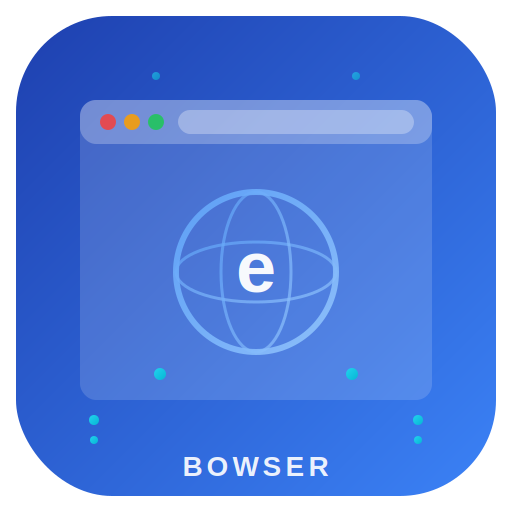

<p align="center">
  
  <h1 align="center">🌐 eBrowser</h1>
  <p align="center"><em>A lightweight web browser for embedded and IoT devices</em></p>
</p>

<p align="center">
  <a href="https://github.com/embeddedos-org/eBrowser/actions"></a>
  <a href="https://github.com/embeddedos-org/eBrowser/blob/main/LICENSE"></a>
  
</p>

---

## 🚀 Quick Start — Zero Prerequisites

No tools needed. The setup scripts auto-detect your OS and install everything (compiler, CMake, SDL2, LVGL):

**Linux / macOS:**
```bash
git clone --recursive https://github.com/embeddedos-org/eBrowser.git
cd eBrowser
chmod +x setup.sh
./setup.sh                        # builds and opens the browser
./setup.sh https://example.com    # opens directly to a URL
```

**Windows (Command Prompt or PowerShell):**
```batch
git clone --recursive https://github.com/embeddedos-org/eBrowser.git
cd eBrowser
setup.bat                         # builds and opens the browser
setup.bat https://example.com     # opens directly to a URL
```

> The scripts automatically install: **MSYS2 + GCC** (Windows), **GCC/Clang** (Linux/macOS), **CMake**, **SDL2**, and **LVGL v9.2** — then build and launch eBrowser with a real 800×480 GUI window.

---

## Overview

eBrowser is a minimal, embeddable web browser engine designed for resource-constrained embedded systems and IoT devices. It provides essential web-rendering capabilities while maintaining a tiny footprint suitable for platforms with limited memory, storage, and processing power.

**Design goals:**

- **Minimal footprint** – small binary size and low ROM usage
- **Low memory usage** – operates within tight RAM constraints typical of embedded targets
- **Portability** – runs on a wide range of hardware and operating systems through a clean platform abstraction layer

---

## Features

- 🔤 **Lightweight HTML/CSS rendering** – core subset of HTML5 and CSS for standard page layout
- ⚡ **Minimal JavaScript support** – optional JS engine for basic interactivity
- 🧠 **Low memory footprint** – optimized data structures and allocation strategies for embedded systems
- 🖥️ **Cross-platform embedded OS support** – Linux, RTOS, bare-metal, and custom OS targets
- ⚙️ **Configurable build** – CMake-based build system with feature toggles for different hardware targets
- 🧩 **Modular architecture** – cleanly separated rendering, networking, and input-handling components

---

## Architecture

eBrowser is organized into layered modules that can be individually configured or replaced:

| Layer | Description |
|---|---|
| **Core Engine** | HTML parser, CSS engine, layout engine |
| **Rendering Backend** | Framebuffer / display abstraction for pixel output |
| **Network Stack** | HTTP/HTTPS client with optional TLS support |
| **Input Layer** | Touch, keyboard, and pointer input abstraction |
| **Platform Abstraction Layer (PAL)** | OS and hardware portability interface |

```
┌─────────────────────────────────────────────┐
│                 Application                 │
├─────────────────────────────────────────────┤
│   Core Engine (HTML / CSS / Layout / JS)    │
├──────────────┬──────────────┬───────────────┤
│  Rendering   │   Network    │    Input      │
│  Backend     │   Stack      │    Layer      │
├──────────────┴──────────────┴───────────────┤
│       Platform Abstraction Layer (PAL)      │
├─────────────────────────────────────────────┤
│          OS / Hardware / Drivers             │
└─────────────────────────────────────────────┘
```

---

## Getting Started

### Prerequisites

- C/C++ toolchain (GCC ≥ 9 or Clang ≥ 11)
- [CMake](https://cmake.org/) ≥ 3.16
- Platform SDK for your target device (if cross-compiling)

### Clone

```bash
git clone https://github.com/embeddedos-org/eBrowser.git
cd eBrowser
```

### Build

```bash
mkdir build && cd build
cmake ..
make
```

To cross-compile for a specific target, pass a toolchain file:

```bash
cmake -DCMAKE_TOOLCHAIN_FILE=../cmake/eos.cmake ..
```

### Run

```bash
./eBrowser https://example.com
```

---

## Usage & Configuration

```
eBrowser [options] <url>
```

| Flag | Description |
|---|---|
| `--resolution WxH` | Set display resolution (e.g. `800x480`) |
| `--no-js` | Disable JavaScript engine |
| `--cache-size <MB>` | Set page cache size in megabytes |
| `--log-level <level>` | Set log verbosity (`error`, `warn`, `info`, `debug`) |
| `--fullscreen` | Launch in fullscreen mode |
| `--help` | Show help and exit |

**Examples:**

```bash
# Browse with a 480x320 display and no JavaScript
./eBrowser --resolution 480x320 --no-js https://example.com

# Enable debug logging
./eBrowser --log-level debug https://example.com
```

---

## API Reference

eBrowser exposes an embedding API for integrating the browser engine into other applications:

```c
#include "eBrowser/eBrowser.h"

eb_config cfg = eb_config_default();
eb_instance *browser = eb_create(&cfg);
eb_navigate(browser, "https://example.com");
eb_run(browser);
eb_destroy(browser);
```

For full API documentation, see the [`docs/`](docs/) directory.

---

## Project Structure

```
eBrowser/
├── src/               # Core source files
│   ├── engine/        # HTML parser, CSS engine, layout
│   ├── render/        # Rendering backend
│   ├── network/       # HTTP/HTTPS client
│   └── input/         # Input handling
├── include/           # Public headers
├── platform/          # Platform abstraction layers
├── port/              # Platform entry points
│   ├── sdl2/          # Desktop (SDL2)
│   ├── eos/           # EoS embedded
│   └── web/           # Emscripten/WASM
├── tests/             # Unit and integration tests
├── docs/              # Documentation
├── assets/            # Logo and branding
├── CMakeLists.txt
├── LICENSE
└── README.md
```

---

## Testing

eBrowser includes 7 comprehensive test suites with 130+ test cases:

```bash
cmake -B build -DBUILD_TESTING=ON
cmake --build build
cd build && ctest --output-on-failure
```

| Test Suite | Tests | Coverage |
|---|---|---|
| `test_dom` | 29 | DOM tree creation, attributes, search, tree ops |
| `test_html_parser` | 27 | Tokenizer, void elements, HTML5, forms, tables |
| `test_css_parser` | 42 | Colors, lengths, selectors, style resolution |
| `test_layout` | 18 | Viewport init, box building, block/inline layout |
| `test_url` | 33 | URL parsing, ports, resolution, real-world URLs |
| `test_input` | 16 | Pointer, keyboard, touch, callbacks, user data |
| `test_platform` | 13 | Detection, alloc, file I/O, tick |

---

## Security

eBrowser includes security features for safe browsing on embedded devices. Contributions improving security are especially welcome.

### TLS Configuration

- TLS 1.2 is the minimum supported version; TLS 1.3 is preferred
- Peer certificate verification and hostname validation are **enabled by default** — do not disable in production
- The default cipher suite preference is: AES-128-GCM-SHA256, AES-256-GCM-SHA384, AES-128-CBC-SHA256
- Provide a CA certificate bundle via `eb_tls_config_t.ca_cert_path` for proper chain-of-trust validation
- **Note:** The current TLS I/O functions (`eb_tls_read`/`eb_tls_write`) are stubs pending a full transport implementation — do not use for production traffic without completing the implementation

### Cookie Security

Cookies set via `eb_cookie_jar_set()` include security attributes by default:

- **HttpOnly** — prevents JavaScript access to cookies, mitigating XSS attacks
- **Secure** — cookies are only sent over HTTPS connections
- **SameSite=Lax** — provides CSRF protection while allowing top-level navigations

### Building with Sanitizers

For development and testing, enable AddressSanitizer and UndefinedBehaviorSanitizer:

```bash
mkdir build && cd build
cmake .. -DCMAKE_BUILD_TYPE=Debug -DENABLE_SANITIZERS=ON
make -j$(nproc)
```

### Security Scanning

The repository runs automated security analysis via GitHub Actions:

- **[CodeQL](.github/workflows/codeql.yml)** — static analysis for C/C++ vulnerabilities on every push and weekly
- **[OpenSSF Scorecard](.github/workflows/scorecard.yml)** — supply chain security assessment
- **[Weekly Tests](.github/workflows/weekly.yml)** — comprehensive testing with Valgrind memory checks

To report a security vulnerability, please open a [GitHub Issue](https://github.com/embeddedos-org/eBrowser/issues) with the `security` label.

---

## Contributing

Contributions are welcome! To get started:

1. **Fork** the repository
2. **Create a branch** for your feature or fix (`git checkout -b feature/my-feature`)
3. **Commit** your changes with clear, descriptive messages
4. **Push** to your fork and open a **Pull Request**

### Guidelines

- Follow the [Google C++ Style Guide](https://google.github.io/styleguide/cppguide.html) for code formatting
- Add tests for new functionality in the `tests/` directory
- Keep pull requests focused — one feature or fix per PR
- Report bugs and request features via [GitHub Issues](https://github.com/embeddedos-org/eBrowser/issues)

---

## License

MIT License

Copyright © 2025 embeddedos-org

Permission is hereby granted, free of charge, to any person obtaining a copy of this software and associated documentation files (the "Software"), to deal in the Software without restriction, including without limitation the rights to use, copy, modify, merge, publish, distribute, sublicense, and/or sell copies of the Software, and to permit persons to whom the Software is furnished to do so, subject to the following conditions:

The above copyright notice and this permission notice shall be included in all copies or substantial portions of the Software.

THE SOFTWARE IS PROVIDED "AS IS", WITHOUT WARRANTY OF ANY KIND, EXPRESS OR IMPLIED, INCLUDING BUT NOT LIMITED TO THE WARRANTIES OF MERCHANTABILITY, FITNESS FOR A PARTICULAR PURPOSE AND NONINFRINGEMENT. IN NO EVENT SHALL THE AUTHORS OR COPYRIGHT HOLDERS BE LIABLE FOR ANY CLAIM, DAMAGES OR OTHER LIABILITY, WHETHER IN AN ACTION OF CONTRACT, TORT OR OTHERWISE, ARISING FROM, OUT OF OR IN CONNECTION WITH THE SOFTWARE OR THE USE OR OTHER DEALINGS IN THE SOFTWARE.
